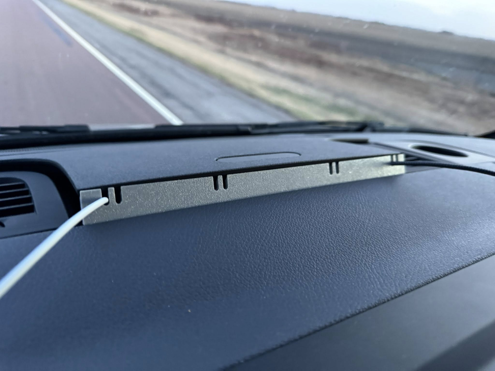
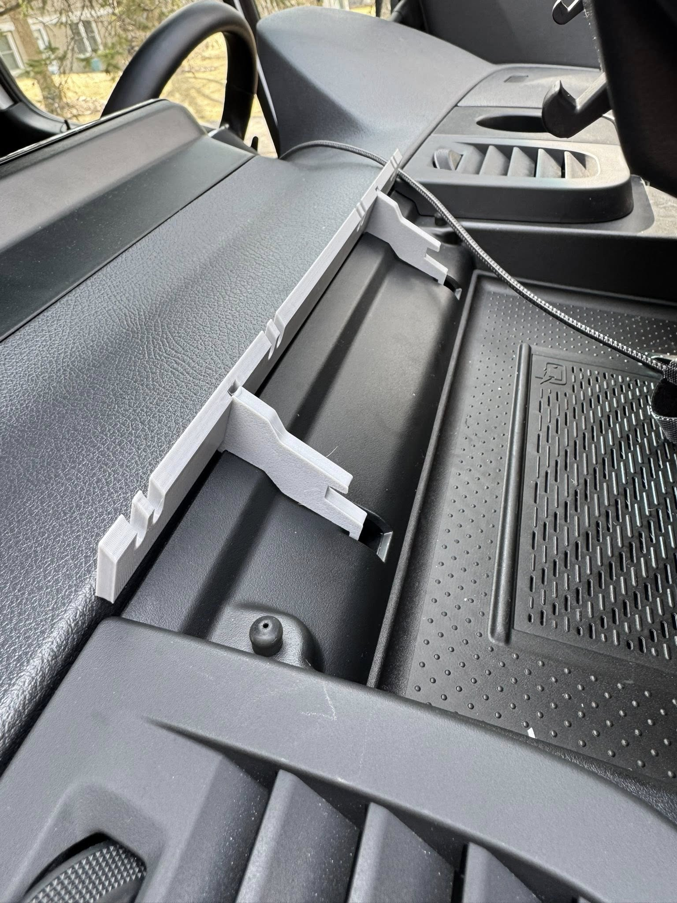
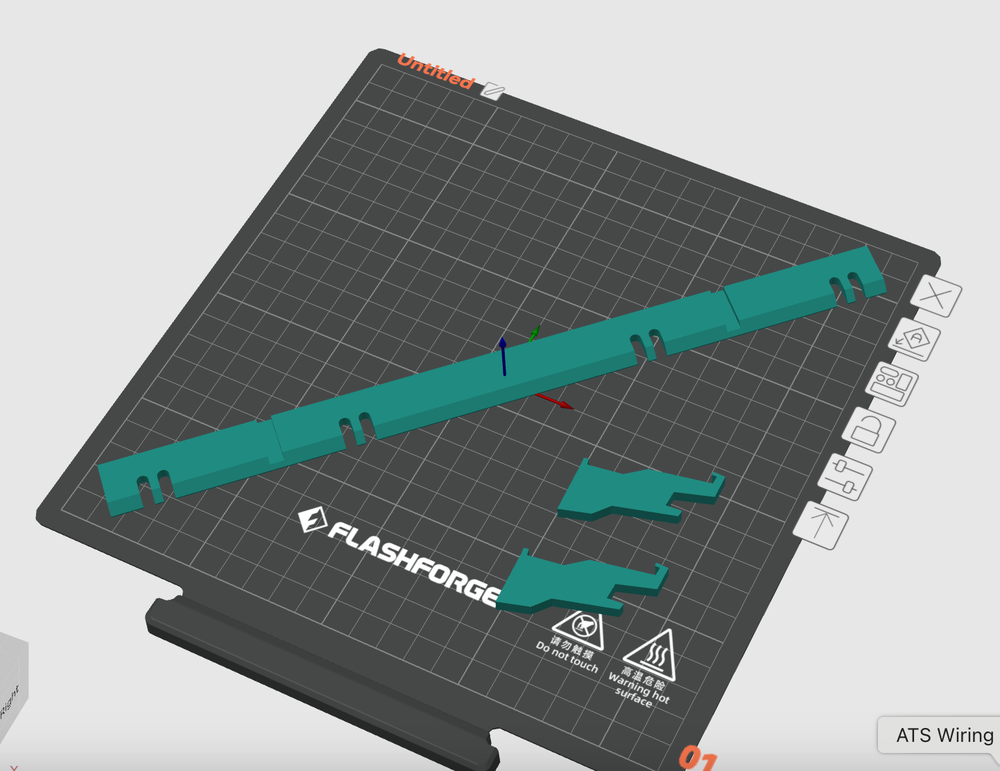

# third-generation-sprinter-charger-cable-holder
Fusion 360 and STL files for a cable holder for the center console on third generation (2019+) Mercedes Benz Sprinters with vents on the dash

Instructions:
1. Print with something that can withstand the high heat of a car dashboard. I used PETG. 
2. Print 2 of charger-cable-holder-support.stl. Print on their sides for strength.
3. Print 1 charger-cable-holder-face.stl. Print face down. Rotate diagonally across the bed and it'll fit on a 220x220 (I printed mine on a FlashForge Adventure 5M).
4. Snap the two support pieces into the slots on the dashboard where the latches for panel door normally latch. Snap them into place by hooking the back of the support into the slot and then pushing the front down into the groove along the front of the compartment. Ensure they're spaced the correct distance apart to fit into the grooves on the faceplate by test fitting the spacing. Ensure the panel door closes as expected.
5. Grab some gorilla glue and put a dab at the top of faceplate grooves and put everything in place. My compartment wasn't in there quite square so I just lined everything up to look nice from the outside even though it meant the support wasn't fully seated, but it still works.

To dos:
This is my first Fusion 360 project so I'm still learning. There's several improvements I'd like to make - or if others want to contribute I'll pull in the changes.
1. The faceplate extrude became detached from its sketch. I need to redo that so adjustments can be made more easily to the faceplate.
2. The cable grooves are fairly tight on braided cables. I'd like to make each pair of grooves have one small and one large groove in case people have larger cables.
3. Add sides. I'd like to add slides to fill the gap as the panel door tapers down for a more polished look.
4. Design flourishes. An embossed topographic map would look cool. It'd be nice to have various design options available for people to choose from.
5. Optimize height. I think we might be able to make the face a little shorter to minimize the height. It'll take some reconfiguration of the supports.
6. Remove the need for glue. I think if the tolerance was tightened from 0.4mm to 0.2mm on the connection between the faceplate and the supports then glue might not be required. 

